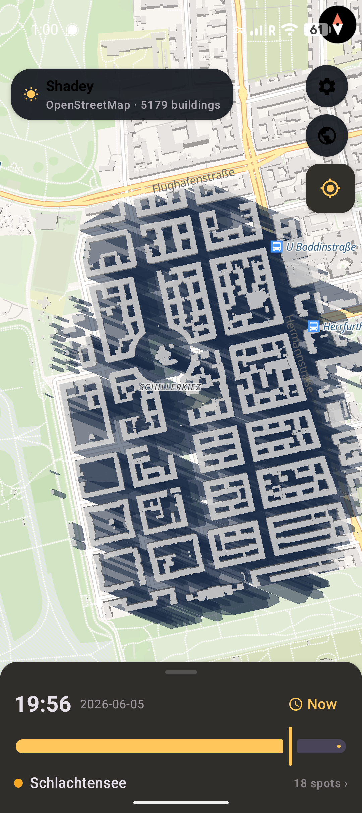
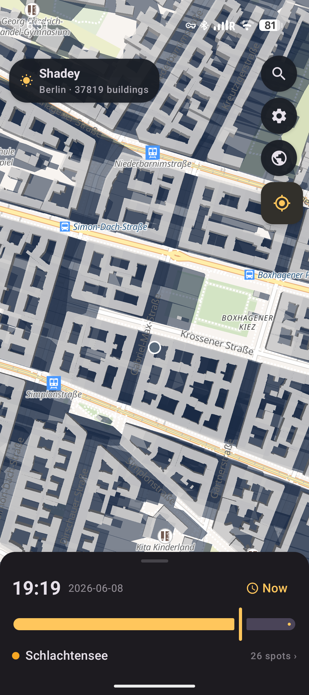

# ☀️ Shadey

<p align="center">
  
  
</p>

**Find the sun.** Shadey shows whether a spot — a café terrace, a park bench, a
canal bank — is in **sunlight or shade** right now (or at any time of day),
computed from real **building shadows**. It's an English, Berlin-first,
fully-private take on [jveuxdusoleil.fr](https://jveuxdusoleil.fr/).

- 🔒 **Private by design.** No accounts, no ads, no analytics, no crash
  reporting, no Shadey server. The sun/shade maths and Berlin's building data run
  **entirely on your device**. The only things that use the network are the base
  map and (optionally) downloading another city — see [Privacy](#privacy) for a
  precise account of what leaves your device and why.
- 🧮 **Real shadows.** Sun position from the NOAA solar equations + 3D building
  geometry from OpenStreetMap → an actual ray-cast to the sun.
- 🗺️ **Smooth 3D map.** MapLibre GL with extruded buildings and an animated
  ground-shadow overlay you can scrub through the day.
- 📍 **Add spots easily.** Tap anywhere to check a point; save your own spots —
  stored only on your device, never uploaded.
- 🌍 **Travels with you.** Download any city's buildings once; after that its
  shade works fully offline.
- 🆓 **100% FOSS.** Kotlin, Jetpack Compose, MapLibre, OpenStreetMap. MIT-licensed code.

> **Status:** the on-device engine is complete and unit-tested (22 tests). The
> Android UI is implemented and builds via CI (this dev container has no Android
> SDK, so the APK is produced by GitHub Actions / your machine — see below).

## How it works

```
        sun azimuth + elevation (NOAA, pure maths)
                       │
   building footprints + heights (OpenStreetMap)
                       │
                       ▼
   ShadowEngine: cast a ray from the point toward the sun.
   If a building's prism blocks it (the ray is below the
   roof where it first crosses the footprint) → SHADE.
```

The heavy lifting lives in a **pure-Kotlin `:core` module** with no Android
dependencies, so it's fast, portable, and testable on any JVM.

## Project layout

| Module / dir | What |
|---|---|
| `core/` | Pure-Kotlin engine: solar position, geometry, `ShadowEngine`, `SpotRanker`, GeoJSON parsing. Unit-tested. |
| `app/` | Android app: Jetpack Compose UI + MapLibre map, offline + downloadable city data sources, local saved spots. |
| `app/src/main/assets/data/` | Bundled `spots.json` (curated Berlin spots) + building GeoJSON. |
| `data-pipeline/` | Python scripts to generate the bundled OSM data (run locally). |
| `.github/workflows/` | CI that runs the tests and builds the APK. |

## Build & run

Requires JDK 17+ and the Android SDK (`ANDROID_HOME` set, or use Android Studio).

```bash
# 1. Generate the bundled sample buildings (no network needed)
python3 data-pipeline/make_sample.py

# 2. (Optional) Replace with real Berlin OSM data — needs network
python3 -m pip install -r data-pipeline/requirements.txt
python3 data-pipeline/fetch_osm.py

# 3. Build the debug APK
./gradlew :app:assembleDebug
# → app/build/outputs/apk/debug/app-debug.apk
```

Open the project in Android Studio and hit ▶ to run on a device/emulator.

### Run just the engine tests (no Android SDK required)

```bash
SHADEY_CORE_ONLY=true ./gradlew :core:test
```

The `SHADEY_CORE_ONLY` flag excludes the Android module so the pure-Kotlin core
compiles and tests with only a JDK + Maven Central.

### CI

`.github/workflows/android.yml` installs the Android SDK, runs the core tests,
builds the debug APK and uploads it as a build artifact on every push/PR.

## Privacy

Privacy is a **core feature** of Shadey, not an afterthought. This is an honest,
exhaustive account of what stays on your device and what leaves it.

**There is no Shadey server.** Shadey has no backend, no accounts, and no
analytics, ads, crash reporting, or telemetry of any kind. When the app does use
the network, requests go *directly* from your phone to OpenStreetMap-ecosystem
services — only for the specific features listed below.

### Runs entirely on your device — never sent anywhere

- ☀️ **All sun/shade computation** — the NOAA solar maths and the building
  ray-cast (the `:core` module) are pure on-device code.
- 🏙️ **Berlin's building data** — bundled inside the APK; nothing to download.
- 📍 **Your saved spots** — kept in local app storage (DataStore) and never
  transmitted.
- 🌆 **Cities you've downloaded** — cached in the app's private storage and
  reused offline.
- 🛰️ **Your GPS location** — used only to centre the map, resolved on-device,
  and sent to no one.

### What uses the internet — what's sent, to whom, and why

| Feature | When | Server contacted | What's sent | Why |
|---|---|---|---|---|
| **Base map** | Automatically whenever the map is on screen (including in Berlin), if you're online | `tiles.openfreemap.org` (OpenFreeMap) | The map area you're viewing — the tile coordinates of wherever you pan/zoom | To draw the streets, water and labels *under* the shadow overlay |
| **Place search** | Only when you type in the search box | `nominatim.openstreetmap.org` (OSM Nominatim) | Your search text, plus the current map area to bias results | To find a place to jump to or download |
| **Download a city** | Only when you tap **Download** on a result | `overpass-api.de`, falling back to `overpass.kumi.systems` | The bounding box (≈8 × 8 km) of the chosen area | To fetch that city's building footprints + heights so its shade works offline afterwards |

A few things worth being explicit about:

- **Your IP address** is necessarily visible to whichever server you contact —
  this is true of any networked app. Combined with the base-map tile requests,
  OpenFreeMap could in principle infer the rough area you're viewing while you
  use the app.
- Every request identifies the app with a `User-Agent` of
  `Shadey/1.0 (+https://github.com/phrag/shadey)`. No device ID, advertising ID,
  or personal data is attached.
- City downloads only ever contact the two community Overpass mirrors above
  (`overpass.kumi.systems` is tried only if `overpass-api.de` is unreachable).

### Offline mode

There is no separate "offline mode" switch — Shadey simply **degrades
gracefully** when there's no network:

| Situation | Works offline | Needs network |
|---|---|---|
| **In Berlin** | All shade, sun positions, spots, time-scrubbing | The base map only (streets/labels won't load — you'll see shadows on a blank background) |
| **In a city you've already downloaded** | All shade, sun positions, spots | The base map only |
| **Somewhere new, never downloaded** | — | The base map, plus a one-time city download to compute shade |

So Shadey is **fully usable offline** for Berlin and for any city you've
downloaded before; the only thing the network adds at that point is the
cosmetic base map. Switch on airplane mode in Berlin and the shade still works.

> **Tip:** When you *are* online, panning to a new place shows live shade using
> building outlines read straight from the base-map tiles already on screen — so
> downloading a city is only needed to keep its shade available **offline**.

### Permissions

| Permission | Why | Notes |
|---|---|---|
| `INTERNET` | Base map, place search, city downloads | — |
| `ACCESS_FINE_LOCATION` / `ACCESS_COARSE_LOCATION` | Centre the map on your current position | **Optional.** Only requested when you tap **My Location**. Never accessed in the background; the result never leaves the device. |

## Adding spots & cities

- **In-app:** tap the map → "Save" to store a spot locally.
- **Curated list:** edit `app/src/main/assets/data/spots.json`.
- **New city:** run `fetch_osm.py --bbox …` for the area and register it in
  `BuildingRepository`. See `data-pipeline/README.md`.

## Roadmap ideas

- Bundled street/water context tiles for a richer offline basemap
- Downloadable region packs (keep everything offline beyond Berlin)
- Tree canopy & terrain shading
- "Sunny near me" using on-device location (opt-in)

## License & attribution

- Code: **MIT** (see `LICENSE`).
- Map & building data: **© OpenStreetMap contributors, ODbL**
  (https://www.openstreetmap.org/copyright).
- Maps rendered with **MapLibre GL** (BSD-2-Clause).
